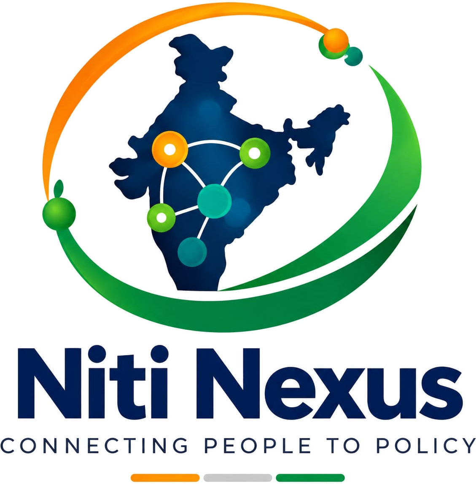

NitiNexus

  

<h3 align="center">AI-Driven Scheme Matching for Marginalized Entrepreneurs</h3>

  <b>Smart India Hackathon 2026</b> · Problem Statement SIH26092

  <b>Theme:</b> Smart Automation &nbsp; | &nbsp;
  <b>Category:</b> Software

📌 About the Project

NitiNexus is a working prototype developed for Smart India Hackathon 2026 under Problem Statement SIH26092: AI-Driven Scheme Matching for Marginalized Entrepreneurs.

The project addresses the challenge of helping marginalized entrepreneurs discover government schemes relevant to their individual and business requirements. Government schemes often have different eligibility criteria, benefits, conditions, and application requirements, making it difficult for users to identify the opportunities most suitable for them.

NitiNexus provides a centralized digital platform where users can provide relevant profile and business information, explore schemes, evaluate eligibility, and receive relevant scheme recommendations through a structured matching process.

The platform also includes scheme details, partner discovery and routing, EMI-related functionality, a user dashboard, and profile management.

🎯 Problem Statement

Problem Statement ID

SIH26092

Title

AI-Driven Scheme Matching for Marginalized Entrepreneurs

Category

Software

Theme

Smart Automation

Sponsoring Organization

Ministry of Social Justice and Empowerment (MoSJE)

❓ The Problem We Address

Marginalized entrepreneurs may face several difficulties while trying to discover and understand government schemes and support opportunities:

Scheme information may be distributed across different sources.

Eligibility criteria can be difficult to understand and compare.

Users may not know which schemes are relevant to their profile.

Manually checking multiple schemes can be time-consuming.

Important opportunities may be missed because users are unaware of them.

Financial and support requirements may require additional guidance.

These challenges create a need for a more structured and personalized approach to scheme discovery and eligibility evaluation.

💡 Our Solution

NitiNexus provides a centralized platform designed around the following workflow:

User
  │
  ▼
Profile & Business Information
  │
  ▼
Data Validation
  │
  ▼
Eligibility Evaluation
  │
  ▼
Scheme Matching
  │
  ▼
Relevant Recommendations
  │
  ├───────────────┐
  ▼               ▼
Scheme Details   Partner Discovery
  │               │
  └───────┬───────┘
          ▼
      User Support

The objective is to simplify the process from user information collection to scheme discovery and relevant recommendations.

✨ Key Features

1. Personalized Scheme Matching

NitiNexus evaluates relevant user and business information to identify schemes that may be suitable for the user.

The matching functionality is handled through the application's scheme matching logic.

2. Eligibility Evaluation

The platform evaluates user information against scheme-related requirements and helps present eligibility results in a structured manner.

Users can understand:

Which schemes are relevant

Eligibility-related results

Scheme information

Available opportunities

3. User Profile Management

Users can provide and manage information required for scheme discovery and matching.

The profile can include relevant information such as:

Personal details

Location

Business information

Business sector

Investment-related information

Other eligibility parameters

4. Scheme Discovery

The platform provides a centralized interface for discovering and exploring government schemes.

Instead of manually navigating through multiple sources, users can access scheme-related information through NitiNexus.

5. Detailed Scheme Information

Users can access detailed information about individual schemes through dedicated scheme detail pages.

This helps present scheme information in a more organized and accessible format.

6. User Dashboard

The dashboard provides a centralized view of important user information and platform results.

It brings together relevant areas such as:

Profile information

Scheme recommendations

Eligibility-related results

Relevant opportunities

7. Partner Discovery and Routing

NitiNexus includes partner-related functionality to help users explore relevant support options.

The application contains partner routing and partner information modules for this purpose.

8. EMI Functionality

The project includes EMI-related functionality to help users explore financial calculations and related information.

9. FAQ Section

The application includes an FAQ section to help users understand the platform and address common questions.

10. Structured User Interface

The platform includes a structured user interface with reusable components and dedicated pages for different parts of the user journey.

🖥️ Application Pages

NitiNexus currently includes the following major pages and sections:

Page / Section

Purpose

Home

Introduces the platform and its purpose

Profile

Collects and manages relevant user information

Dashboard

Provides an overview of user information and results

Scheme Details

Displays detailed information about individual schemes

Partners

Displays partner-related information

Partner Details

Provides details related to partners

FAQ

Answers commonly asked questions

🏗️ System Architecture

                         ┌─────────────────┐
                         │      USER       │
                         └────────┬────────┘
                                  │
                                  ▼
                    ┌─────────────────────────┐
                    │        FRONTEND         │
                    │     React Application   │
                    │                         │
                    │  Pages + Components     │
                    └────────────┬────────────┘
                                 │
                              API Calls
                                 │
                                 ▼
                    ┌─────────────────────────┐
                    │         BACKEND         │
                    │    Application Logic    │
                    └────────────┬────────────┘
                                 │
                 ┌───────────────┼────────────────┐
                 │               │                │
                 ▼               ▼                ▼
          Profile Processing  Scheme Matching  Partner Routing
                 │               │                │
                 └───────────────┼────────────────┘
                                 │
                                 ▼
                         Eligibility Results
                                 │
                                 ▼
                      Relevant Recommendations

🔄 How the System Works

Step 1 — User Visits NitiNexus

The user starts by accessing the NitiNexus platform.

Step 2 — User Provides Information

Relevant personal and business information is provided through the profile interface.

Step 3 — Data Processing

The application processes the submitted information.

Step 4 — Scheme Matching

The matching engine evaluates relevant information for scheme matching and eligibility-related processing.

Step 5 — Results

The user can view relevant schemes and explore additional information.

Step 6 — Further Exploration

The user can access:

Scheme details

Partner information

Dashboard results

EMI-related functionality

Frequently asked questions

📂 Project Structure

NitiNexus/
│
├── backend/
│   │
│   ├── app/
│   │   │
│   │   ├── routes/
│   │   │   ├── emi.py
│   │   │   ├── match.py
│   │   │   ├── match_backup.py
│   │   │   ├── partners.py
│   │   │   ├── partners_backup.py
│   │   │   ├── profile.py
│   │   │   └── schemes.py
│   │   │
│   │   ├── database.py
│   │   ├── main.py
│   │   ├── matching_engine.py
│   │   ├── models.py
│   │   ├── partner_routing.py
│   │   └── schemas.py
│   │
│   ├── import_partners.py
│   ├── migrate.py
│   ├── partners_seed.csv
│   ├── requirements.txt
│   └── seed.py
│
├── frontend/
│   │
│   ├── public/
│   │   ├── favicon.svg
│   │   └── icons.svg
│   │
│   ├── src/
│   │   ├── assets/
│   │   │   ├── hero.png
│   │   │   └── nitinexus-logo.png
│   │   │
│   │   ├── components/
│   │   │   ├── AppShell.jsx
│   │   │   ├── Dropdown.jsx
│   │   │   ├── IneligibleSchemeCard.jsx
│   │   │   ├── InputField.jsx
│   │   │   ├── PageNavigation.jsx
│   │   │   ├── PartnerCard.jsx
│   │   │   ├── ProgressStep.jsx
│   │   │   └── SchemeCard.jsx
│   │   │
│   │   ├── pages/
│   │   │   ├── dashboard.jsx
│   │   │   ├── FAQ.jsx
│   │   │   ├── home.jsx
│   │   │   ├── PartnerDetails.jsx
│   │   │   ├── Partners.jsx
│   │   │   ├── profile.jsx
│   │   │   └── SchemeDetails.jsx
│   │   │
│   │   ├── api.js
│   │   ├── App.css
│   │   ├── App.jsx
│   │   ├── index.css
│   │   ├── light-theme.css
│   │   ├── locations.js
│   │   ├── main.jsx
│   │   └── schemes.js
│   │
│   ├── package.json
│   └── vite.config.js
│
├── RUN.md
├── SCHEME_DATA_VERIFICATION.md
├── START_HERE.md
├── .gitignore
└── README.md

🧩 Backend Modules

The backend contains the application's core processing and route-based functionality.

Main Application Components

main.py

Main backend application entry point and application configuration.

database.py

Handles database-related functionality.

matching_engine.py

Contains the core logic related to scheme matching and evaluation.

models.py

Contains application data models.

schemas.py

Defines data structures used for validation and data communication.

partner_routing.py

Contains partner-related routing functionality.

🔌 API Modules

The backend is organized into dedicated route modules.

Module

File

Functionality

EMI

emi.py

EMI-related functionality

Matching

match.py

Scheme matching operations

Partners

partners.py

Partner-related operations

Profile

profile.py

User profile operations

Schemes

schemes.py

Scheme-related operations

Exact API paths, request formats, and response formats are defined by the backend route implementation.

🧱 Frontend Components

The frontend uses reusable components to provide a consistent user experience.

Main Components

AppShell

Dropdown

IneligibleSchemeCard

InputField

PageNavigation

PartnerCard

ProgressStep

SchemeCard

These components support navigation, data collection, scheme display, partner display, and user interaction across the application.

🛠️ Running the Project

Prerequisites

Before running the project, ensure the required frontend and backend dependencies are installed.

You will need:

Node.js and npm for the frontend

Python for the backend

1. Clone the Repository

git clone https://github.com/arnav-jain10/NitiNexus.git

Move into the project directory:

cd NitiNexus

2. Run the Frontend

Open a terminal and move into the frontend directory:

cd frontend

Install dependencies:

npm install

Start the frontend development server:

npm run dev

The terminal will display the local URL where the frontend is running.

3. Set Up the Backend

Open another terminal and move into the backend directory:

cd backend

Create a Python virtual environment:

python -m venv venv

Windows

Activate the environment:

venv\Scripts\activate

macOS / Linux

Activate the environment:

source venv/bin/activate

Install backend dependencies:

pip install -r requirements.txt

For the exact project-specific backend startup procedure, refer to:

START_HERE.md

RUN.md

📖 Additional Documentation

The repository includes supporting documentation.

File

Description

START_HERE.md

Initial guidance for understanding and starting the project

RUN.md

Project running instructions

SCHEME_DATA_VERIFICATION.md

Information related to scheme data verification

📸 Screenshots

The project includes visual assets such as the NitiNexus logo and application imagery.

For a complete project showcase, application screenshots can be added to this repository under a folder such as:

docs/screenshots/

Suggested screenshots:

Home Page

User Profile

Dashboard

Scheme Recommendations

Scheme Details

Partner Discovery

FAQ

Screenshots are not embedded in this README yet because the final screenshot files are not currently included in the repository.

🚀 Future Scope

Possible future enhancements for NitiNexus include:

Expansion of the scheme dataset

More advanced recommendation and matching logic

Improved eligibility analysis

Real-time scheme updates

Multi-language support

Enhanced dashboard analytics

Scheme application tracking

Improved partner integrations

Additional accessibility features

Expanded support for different entrepreneur categories

👥 Team NitiNexus

Project Name: NitiNexus
Team Name: NitiNexus

Team Members

Anshdeep Singh Brar

Arnav Jain

Ritu Pagariya

Nandani Singh

Nirmal Jamliya

Harsh Vardhan Patidar

🏆 Smart India Hackathon 2026

This project was developed as a Working Prototype for:

Smart India Hackathon 2026

Problem Statement

SIH26092 — AI-Driven Scheme Matching for Marginalized Entrepreneurs

Category

Software

Theme

Smart Automation

Sponsoring Organization

Ministry of Social Justice and Empowerment (MoSJE)

📦 Repository

The source code for NitiNexus is available at:

https://github.com/arnav-jain10/NitiNexus

🔒 Security Note

Sensitive information such as:

API keys

Passwords

Credentials

Environment variables

Private configuration files

should not be committed to the repository.

Use .env files for sensitive local configuration and ensure they remain excluded through .gitignore.

📌 Project Status

Working Prototype

Developed for Smart India Hackathon 2026

  <b>NitiNexus</b> 
  Connecting Marginalized Entrepreneurs with Relevant Opportunities

